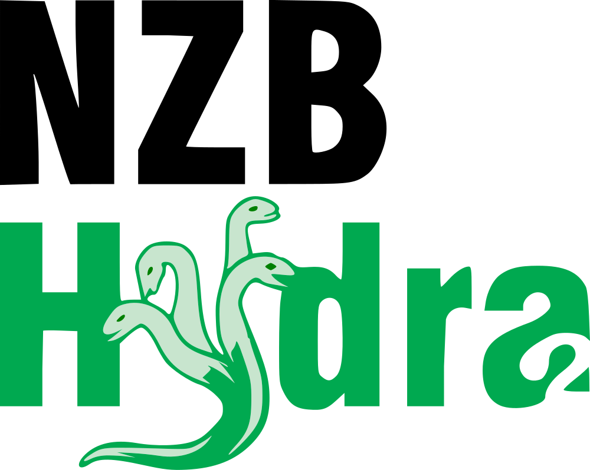

# n8n-nodes-nzbhydra2

Community node for **n8n** to interact with **NZBHydra2**. It lets you automate
NZBHydra2 directly from your n8n workflows using a secure stored credential.

> ✅ **Verified community node** — installable directly from the n8n node panel
> (self-hosted **and** n8n Cloud).

## Installation

This is a **verified** community node: in n8n click **+ (Add node)**, search for
**NZBHydra2**, and add it — no manual install needed.

Manual install (older n8n, or as an unverified package)

Go to **Settings → Community Nodes → Install** and enter `n8n-nodes-nzbhydra2`.

## Operations

| Operation | Description |
|---|---|
| **Get Capabilities** | Get the indexer capabilities |
| **Search** | Search across indexers |

## Authentication

This node uses the **NZBHydra2 API** credential. In n8n, go to **Credentials → New**, pick
**NZBHydra2 API**, and fill in:

- **Base URL** — the address of your instance, e.g. `http://nzbhydra2:5076` (no trailing slash).
- **API Key** — your service API key.

Your API key is sent as the `apikey` query-string parameter.

**Where to find it:** NZBHydra2 → **Config → Main → Security → API key**.

The credential's **Test** button verifies the connection before you save.

## Usage

1. Add the **NZBHydra2** node to a workflow (after a trigger such as *When clicking 'Test workflow'* or a Schedule Trigger).
2. Select your **NZBHydra2 API** credential.
3. Pick an **Operation** and run the workflow — the response is returned as JSON for the next node.

## Compatibility

Requires n8n **1.0** or newer. Built and linted with the official `@n8n/node-cli`, and
published to npm with a build-provenance attestation.

## Resources

- [NZBHydra2](https://github.com/theotherp/nzbhydra2)
- [n8n community nodes documentation](https://docs.n8n.io/integrations/community-nodes/)

## License

[MIT](./LICENSE)
